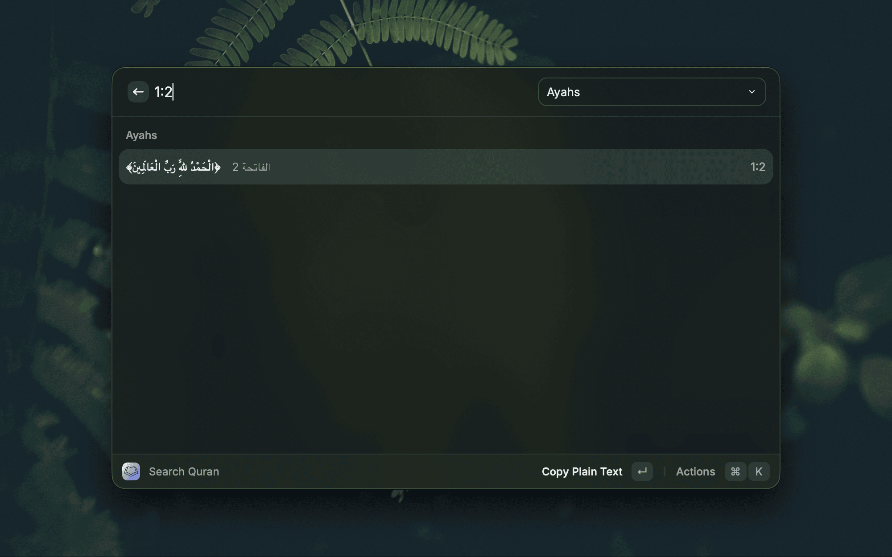
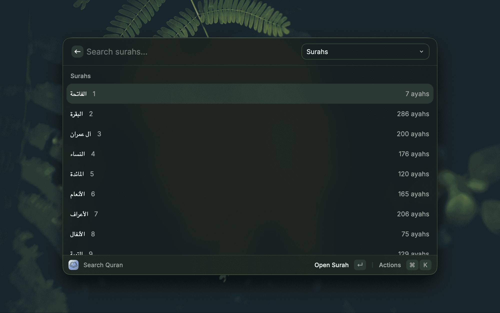
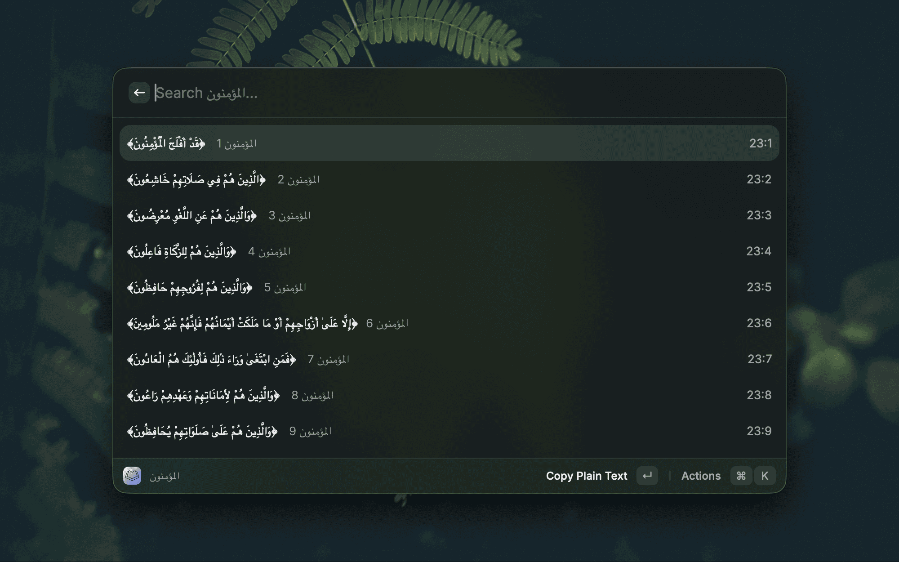
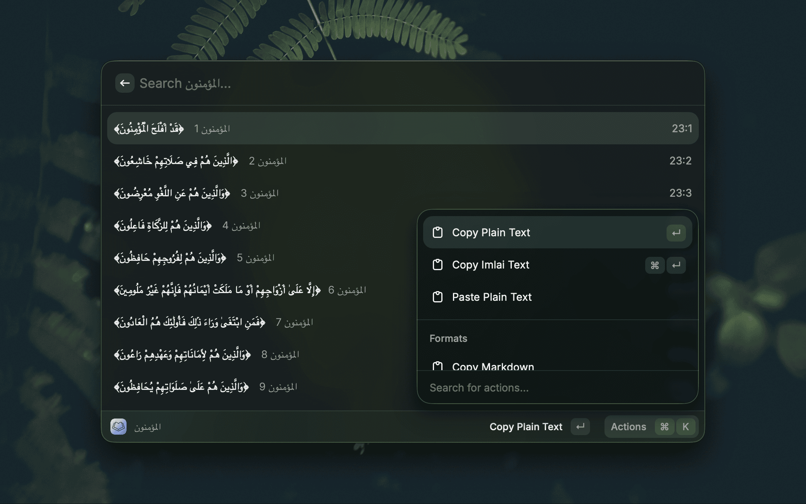
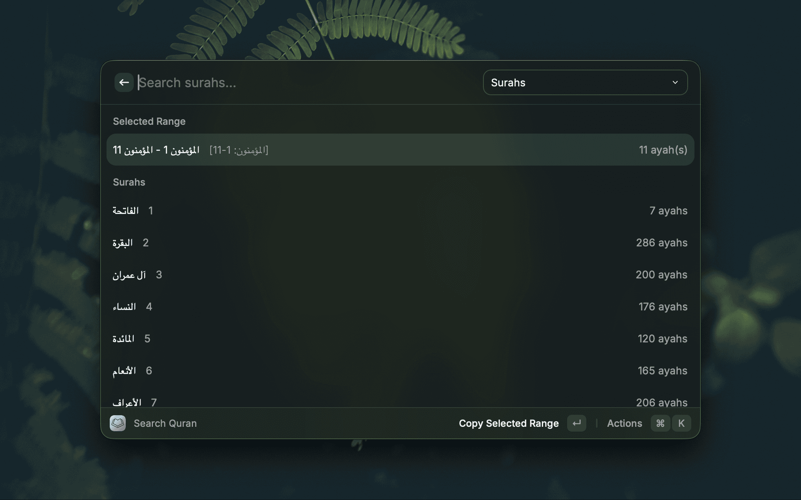
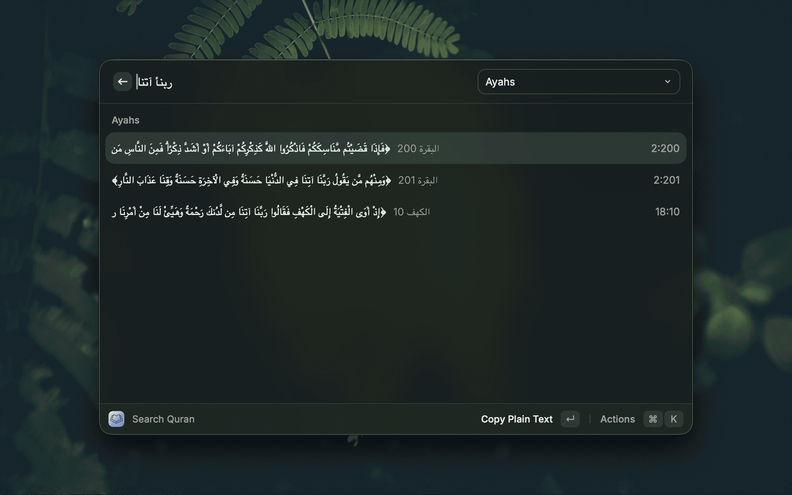

<p align="center">
  
  <h1 align="center">Quran Quick Insert</h1>
</p>

Search, copy, and insert Quran ayahs or ranges from Raycast. Quran text is bundled locally, so search works offline.

> [!CAUTION]
> **Disclaimer:** This project was developed with heavy use of AI assistance. Tested and verified by the author.

<details>
  <summary>Screenshots</summary>

  <p align="center">
    
    
    
    
    
    
  </p>
</details>

## Commands

- **Search Quran**: search Quran text or enter `2:255` / `2:255-257`, then copy or paste the ayah or range.

## Preferences

- **Text Style**: copied output uses Uthmani or Imlai text.
- **Reference Style**: append `[البقرة: 255]`, `(2:255)`, `Quran 2:255`, or no reference.
- **Text Prefix**: optionally prepend `قال تعالى`, الاستعاذة, or البسملة.
- **Simplify Search Letters**: match common Arabic letter variants while searching.
- **Regex Search**: treat search input as a regular expression.
- **Search Harakat**: ignore harakat, match existing harakat only, or require exact harakat.

## Develop

```sh
npm install
npm run dev
```

## Build

```sh
npm run build
```

## Hotkey

Assign a Raycast hotkey to **Search Quran** for the fastest flow: type a word or reference, then copy or paste the result.

## Deeplink

```text
raycast://extensions/yshalsager/quran-quick-insert/search-quran
```

## Quick Test

1. Run **Search Quran** in Raycast.
2. Enter `2:255` or search for `الحمد`.
3. Copy or paste the selected ayah.
